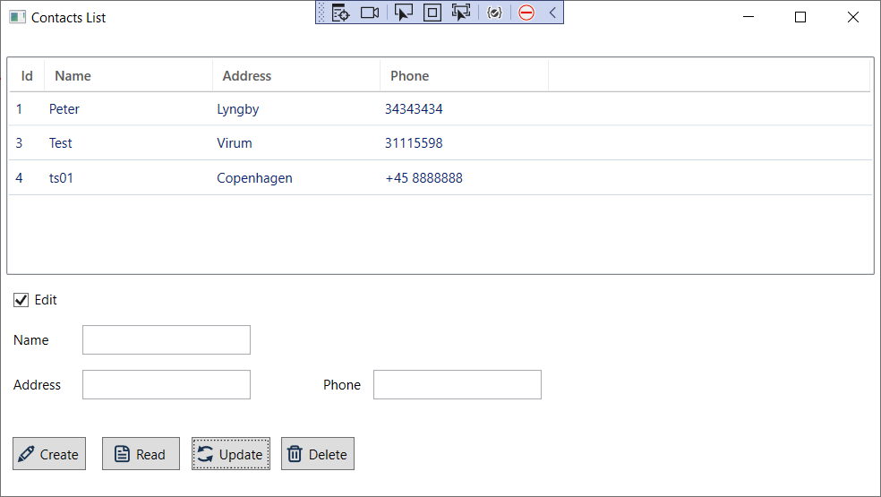

# EF.SQLite
This is the hands-on tutorial of using SQLite Database with entity framework under C# project

# Enviroment

- donet 6.0
- EFcore.Sqlite 6.0.32

# SQLite DB

- optionsBuilder.UseSqlite("Data Source = Contacts.db");

# Feature Update

- reload Contacts list after a record is updated.

# Screen
 

